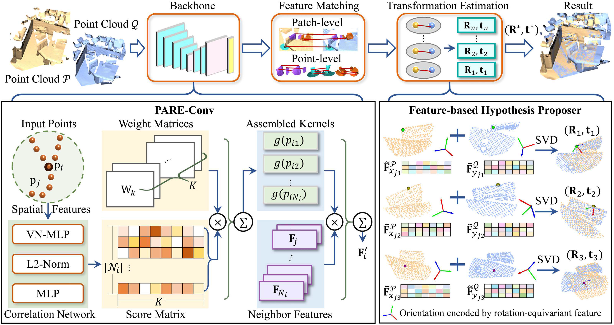
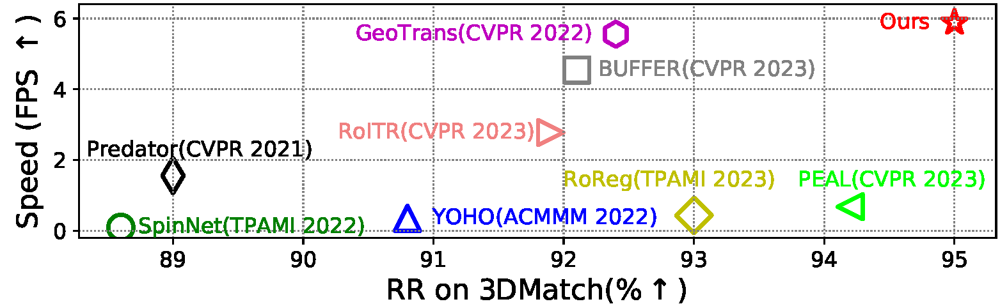
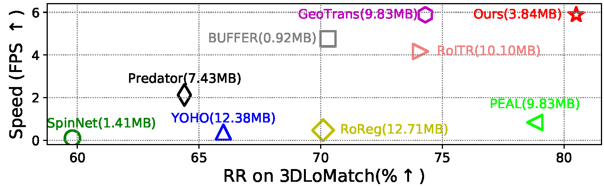

<h2 align="center">
<a href="https://arxiv.org/abs/2407.10142" target="_blank">PARE-Net: Position-Aware Rotation-Equivariant Networks for Robust Point Cloud Registration</a>
</h2>

<h3 align="center">
ECCV 2024
</h3>

<p align="center">
<a href="https://scholar.google.com/citations?hl=en&user=udCF7q4AAAAJ" target="_blank">Runzhao Yao</a>, 
<a href="https://scholar.google.com/citations?user=r2bk4sQAAAAJ&hl=en" target="_blank">Shaoyi Du</a><sup>*</sup>, 
<a href="https://scholar.google.com/citations?user=UClf9_0AAAAJ&hl=en" target="_blank">Wenting Cui</a>, 
<a href="https://scholar.google.com/citations?hl=en&user=TKqkrnUAAAAJ" target="_blank">Canhui Tang</a>, 
Chengwu Yang
</p>

<p align="center">
National Key Laboratory of Human-Machine Hybrid Augmented Intelligence, <br>
National Engineering Research Center for Visual Information and Applications, <br>
Institute of Artificial Intelligence and Robotics, <br>
Xi’an Jiaotong University, China, <br>
<sup>*</sup>Corresponding author. 
</p>

## Introduction

Learning rotation-invariant distinctive features is a fundamental requirement for point cloud registration. Existing methods often use rotation-sensitive networks to extract features, while employing rotation augmentation to learn an approximate invariant mapping rudely. This makes networks fragile to rotations, overweight, and hinders the distinctiveness of features. To tackle these problems, we propose a novel position-aware rotation-equivariant network, for efficient, light-weighted, and robust registration. The network can provide a strong model inductive bias to learn rotation-equivariant/invariant features, thus addressing the aforementioned limitations. To further improve the distinctiveness of descriptors, we propose a position-aware convolution, which can better learn spatial information of local structures. Moreover, we also propose a feature-based hypothesis proposer. It leverages rotation-equivariant features that encode fine-grained structure orientations to generate reliable model hypotheses. Each correspondence can generate a hypothesis, thus it is more efficient than classic estimators that require multiple reliable correspondences. Accordingly, a contrastive rotation loss is presented to enhance the robustness of rotation-equivariant features against data degradation. Extensive experiments on indoor and outdoor datasets demonstrate that our method significantly outperforms the SOTA methods in terms of registration recall while being lightweight and keeping a fast speed. Moreover, experiments on rotated datasets demonstrate its robustness against rotation variations.


<div align="center">
    
</div>


<div align="center">
    
    
</div>


## News

2024.07.20: Code and pretrained models on 3DMatch and KITTI are released.

2024.07.14: Paper is available at [arXiv](https://arxiv.org/abs/2407.10142).

2024.07.04: Our paper is accepted by ECCV 2024!.

## 🔧  Installation

Please use the following command for installation.

```bash
# It is recommended to create a new environment
conda create -n pareconv python==3.8
conda activate pareconv


pip install torch==1.13.0+cu116 torchvision==0.14.0+cu116 torchaudio==0.13.0 --extra-index-url https://download.pytorch.org/whl/cu116

# Install packages and other dependencies
pip install -r requirements.txt
python setup.py build develop

cd pareconv/extentions/pointops/
python setup.py install
```

Code has been tested with Ubuntu 18.04, GCC 7.5.0, Python 3.9, PyTorch 1.13.0, CUDA 11.6 and cuDNN 8.0.5.

## 💾 Dataset and Pre-trained models
we provide pre-trained models in [Google Drive](https://drive.google.com/file/d/1jrPejtxnhMwtlr6LxXNJznm0BxSXP1eY/view?usp=drive_link). Please download the latest weights and put them in `pretain` directory.


Moreover, [3DMatch](https://drive.google.com/file/d/1_6tW-DREQdpGi4idLin8yITHuS_qXXnw/view?usp=drive_link) and [KITTI](https://drive.google.com/file/d/11OtJHWtX5y5dko2SiI3jCmw9zX305rJz/view?usp=drive_link) datasets can be downloaded.

##### 3DMatch should be organized as follows:
```text
--your_3DMatch_path--3DMatch
              |--train--7-scenes-chess--cloud_bin_0.pth
                    |--     |--...         |--...
              |--test--7-scenes-redkitchen--cloud_bin_0.pth
                    |--     |--...         |--...
              |--train_pair_overlap_masks--7-scenes-chess--masks_1_0.npz
                    |--     |--...         |--...       
```

Modify the dataset path in `experiments/3DMatch/config.py` to
```python
_C.data.dataset_root = '/your_3DMatch_path/3DMatch'
```

##### KITTI should be organized as follows:
```text
--your_KITTI_path--KITTI
            |--downsampled--00--000000.npy
                    |--...   |--... |--...
            |--train_pair_overlap_masks--0--masks_11_0.npz
                    |--...   |--... |--...
```                   

Modify the dataset path in `experiments/KITTI/config.py` to
```python
_C.data.dataset_root = '/your_KITTI_path/KITTI' 
```

## ⚽ Demo
After installation, you can run the demo script in `experiments/3DMatch` by:
```bash
cd experiments/3DMatch
python demo.py
```

To test your own data, you can downsample the point clouds with 2.5cm and specify the data path:
```bash
python demo.py --src_file=your_data_path/src.npy --ref_file=your_data_path/ref.npy --gt_file=your_data_path/gt.npy --weights=../../pretrain/3dmatch.pth.tar
```

## 🚅 Training
You can train a model on 3DMatch (or KITTI) by the following commands:

```bash
cd experiments/3DMatch (or KITTI)
CUDA_VISIBLE_DEVICES=0 python trainval.py
```
You can also use multiple GPUs by:
```bash
CUDA_VISIBLE_DEVICES=GPUS python -m torch.distributed.launch --nproc_per_node=NGPUS trainval.py
```
For example,
```bash
CUDA_VISIBLE_DEVICES=0,1 python -m torch.distributed.launch --nproc_per_node=2 trainval.py
```

## ⛳ Testing
To test a pre-trained models on 3DMatch, use the following commands:
```bash
# 3DMatch
python test.py --benchmark 3DMatch --snapshot ../../pretrain/3dmatch.pth.tar
python eval.py --benchmark 3DMatch
```
To test the model on 3DLoMatch, just change the argument `--benchmark 3DLoMatch`.

To test a pre-trained models on KITTI, use the similar commands:
```bash
# 3DMatch
python test.py --snapshot ../../pretrain/kitti.pth.tar
python eval.py
```

## Citation

```bibtex
@inproceedings{yao2024parenet,
    title={PARE-Net: Position-Aware Rotation-Equivariant Networks for Robust Point Cloud Registration},
    author={Runzhao Yao and Shaoyi Du and Wenting Cui and Canhui Tang and Chengwu Yang},
    journal={arXiv preprint arXiv:2407.10142},
    year={2024}
}
```

## Acknowledgements
Our code is heavily brought from
- [GeoTransformer](https://github.com/qinzheng93/GeoTransformer)
- [VectorNeurons](https://github.com/FlyingGiraffe/vnn)
- [PAConv](https://github.com/CVMI-Lab/PAConv)


